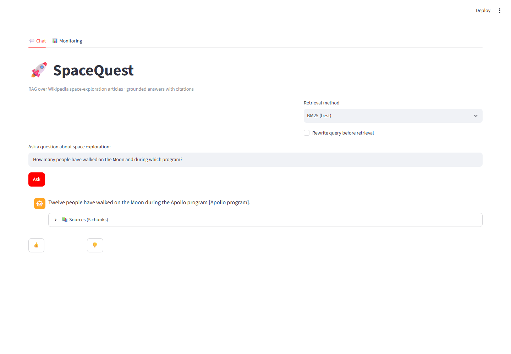
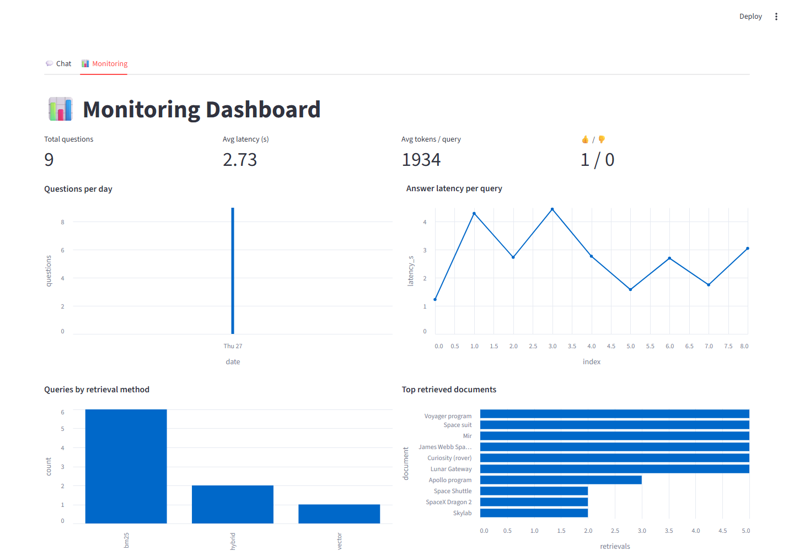

# SpaceQuest: Hybrid RAG over Wikipedia Space-Exploration Articles


SpaceQuest is an end-to-end RAG application that answers questions about space exploration
(Apollo, Space Shuttle, rovers, stations, telescopes, launch sites) using 30 curated Wikipedia
articles (~760 chunks) as its knowledge base. Every answer is grounded in retrieved passages and
cites the source article, chunk, and URL.

Built as a capstone project for the LLM Zoomcamp.

## Preview





## Problem statement

General-purpose chatbots answer space-exploration questions from pre-training memory, so facts
about specific missions get garbled or hallucinated — wrong crew counts for Apollo missions,
confused rover timelines, invented dates. When someone researching missions needs trustworthy
answers (students, writers, educators), ungrounded answers are worse than useless.

SpaceQuest solves this by constraining generation to retrieved evidence: each question first
retrieves relevant chunks from a dedicated knowledge base, and the LLM may only use that context,
citing its sources inline. Retrieval quality was measured across four approaches and generation
quality across two prompt designs, with the best variant shipped (see [Evaluation](#evaluation)).

## Features

- **Hybrid retrieval**: BM25, dense vectors, and Reciprocal Rank Fusion — evaluated head-to-head
- **Query rewriting** option (LLM rewrites the question before retrieval; evaluated)
- **LLM document re-ranking** (`src/rerank.py`, evaluated)
- **Grounded generation** with inline citations `[article title]` and chunk-level source list
- **Streamlit interface**: chat UI + monitoring dashboard
- **User feedback** (👍/👎) collected per query
- **Monitoring dashboard**: 5+ charts over logged queries and feedback
- **dlt ingestion pipeline**, SQLite knowledge base, dockerized app

## Architecture

```
Wikipedia articles (data/corpus)
   └─ dlt pipeline → chunking (300 words, 50 overlap) → SQLite kb.chunks
                    └─ OpenAI embeddings → kb.chunks.embedding
Query → [optional rewrite] → retrieval (bm25 | vector | hybrid RRF)
      → context builder → GPT-4o-mini grounded answer + citations
Every Q&A logged to SQLite (+ 👍/👎 feedback) → Streamlit dashboard
```

## Quick start

Requirements: Python 3.12+, an OpenAI API key.

```powershell
pip install -r requirements.txt
copy .env.example .env        # then paste your OPENAI_API_KEY into .env

# 1. Fetch corpus (committed to repo, re-run only to refresh)
python src/fetch_wiki.py

# 2. Ingest via dlt -> SQLite + embed via OpenAI
python src/ingest_dlt.py
python src/indexing.py

# 3. Ask from the CLI
python -m scripts.ask "How many people have walked on the Moon?"

# 4. Launch the Streamlit app (chat + monitoring dashboard)
streamlit run app/app.py
```

Or run everything containerized:

```powershell
docker compose up --build    # app at http://localhost:8501
```

## Evaluation

### Retrieval evaluation (`eval/eval_retrieval.py`)

87 LLM-generated ground-truth questions (see `eval/build_ground_truth.py`); metrics are
hit-rate@5 and MRR@5 over `data/eval/retrieval_results.json`:

| Method                | Hit-rate@5 | MRR@5 |
|-----------------------|-----------|-------|
| Vector only           | 0.9655    | 0.9540 |
| BM25 only             | **0.9885**| **0.9636** |
| Hybrid (RRF)          | 0.9770    | 0.9626 |
| Hybrid + query rewrite| 0.9770    | 0.9540 |
| BM25 + LLM re-rank    | 0.9885    | 0.8820 |
| Hybrid + LLM re-rank  | 0.9770    | 0.9253 |

BM25 won on this corpus (Wikipedia prose matches keyword queries well), so it is the default.
Hybrid search, query rewriting, and LLM re-ranking (`src/rerank.py`, GPT-4o-mini scoring of
candidate chunks) were all evaluated per the best-practices criteria. Re-ranking kept hit-rate
identical but lowered MRR here — chunk order already matches the lexical ranking — so the plain
BM25 ordering is shipped rather than the re-ranked one.

### LLM output evaluation (`eval/eval_llm.py`)

Two prompt variants scored by an LLM judge over 30 questions (0-5 scale):

| Variant | Avg correctness | Avg groundedness |
|---------|----------------|------------------|
| prompt_v1 (used in app) | **4.700** | **4.533** |
| prompt_v2 | 4.667 | 4.367 |

The better-scoring prompt (`PROMPT_V1`) is used everywhere; per-question details are in
`data/eval/llm_eval_prompt_v1.json` / `llm_eval_prompt_v2.json`.

## Monitoring

Every query is logged to SQLite (`query_log`: question, rewritten question, method, answer,
latency, token usage, sources). Thumbs-up/down feedback goes to a `feedback` table.
The **Monitoring tab** shows: total questions, avg latency/token metrics, questions per day,
latency per query, queries by retrieval method, top retrieved documents, and feedback split.

## Technologies used beyond the course material

- **dlt**: data-loading tool that runs the ingestion pipeline (fetch → chunk → load) into SQLite
- **rank-bm25**: Okapi BM25 lexical scoring for the sparse retrieval leg
- **wikipedia-api**: corpus acquisition

## Repository layout

```
src/fetch_wiki.py      # download Wikipedia corpus
src/ingest_dlt.py      # dlt pipeline -> SQLite knowledge base
src/indexing.py        # OpenAI embeddings stored back into SQLite
src/retrieval.py       # BM25 / vector / hybrid RRF retriever + query rewriting
src/generate.py        # grounded answer generation (two prompt variants)
src/monitoring.py      # query + feedback logging
app/app.py             # Streamlit chat UI + monitoring dashboard
eval/                  # ground-truth generation and both evaluations
data/corpus/, data/eval/  # committed data for reproducibility
```

Environment variables: `OPENAI_API_KEY` (required).
